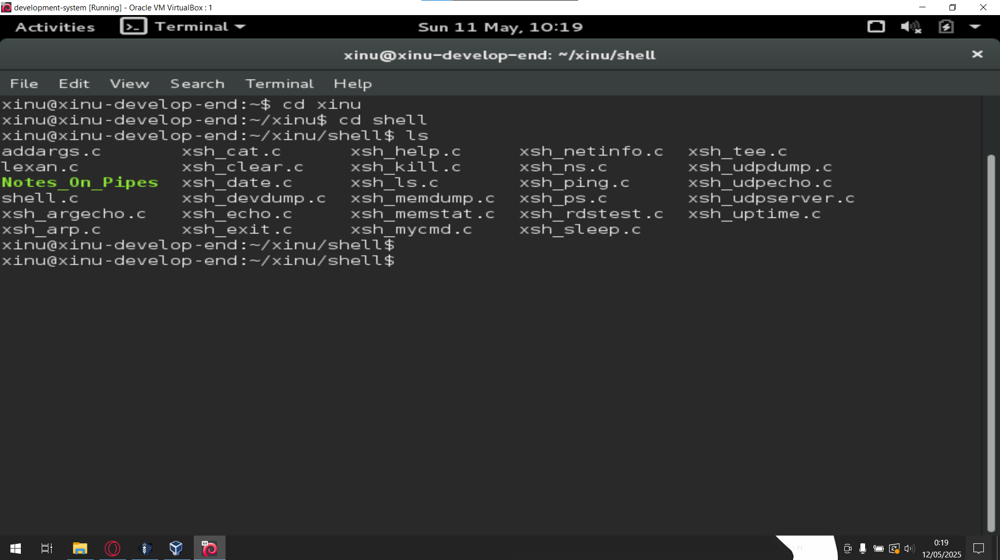
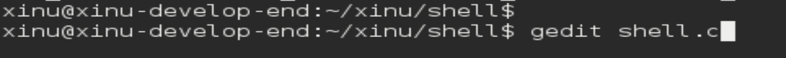
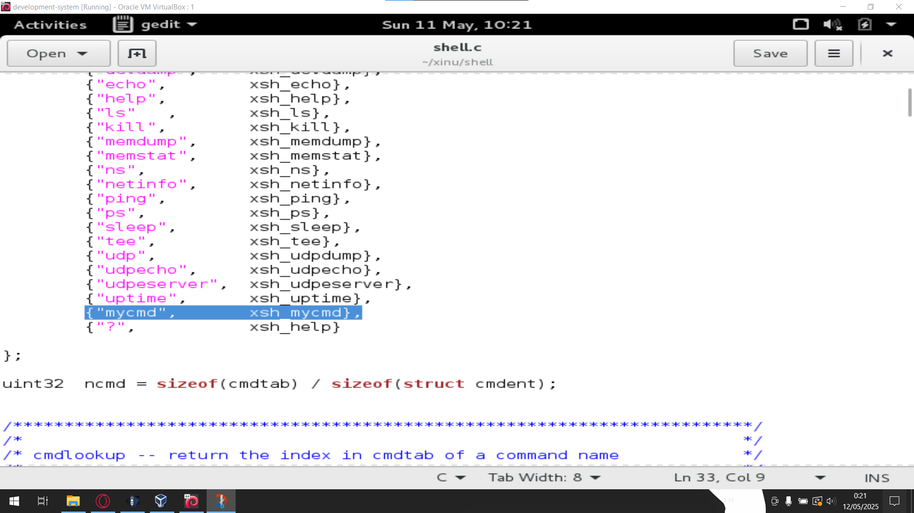
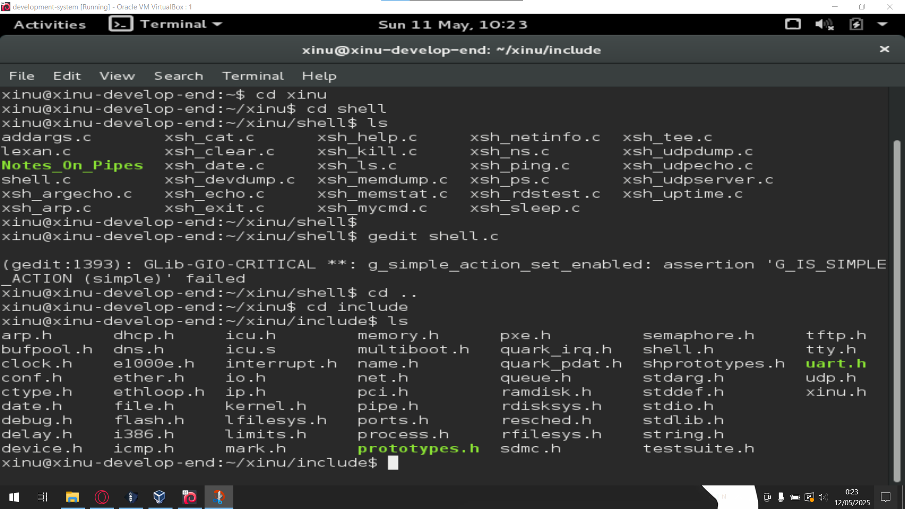
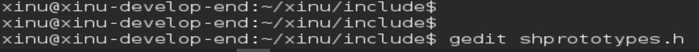

# Tutorial Xinu Shell

Assalamualaikum wr. wb. Kali ini saya akan memberikan tutorial untuk tugas week 10 menambahkan perintah baru ke shell di xinu.

- Pertama, buka development-system nya. Lalu masuk ke directory shell dengan cara:
  ```console
  cd xinu
  cd shell
  ```
  

- Selanjutnya, edit file shell.c dengan cara:
  ```console
  gedit shell.c
  ```
  

- Lalu, tambahkan `{"mycmd",      xsh_mycmd},` dibawah `{"uptime",      xsh_uptime},` seperti gambar dibawah
  

- Setelah itu, keluar dari directory shell lalu masuk ke directory include dengan cara:
  ```console
  cd ..
  cd include
  ```
  

- Kali ini kita akan mengedit file `shprototypes.h` dengan cara:
  ```console
  gedit shprototypes.h
  ```
  
