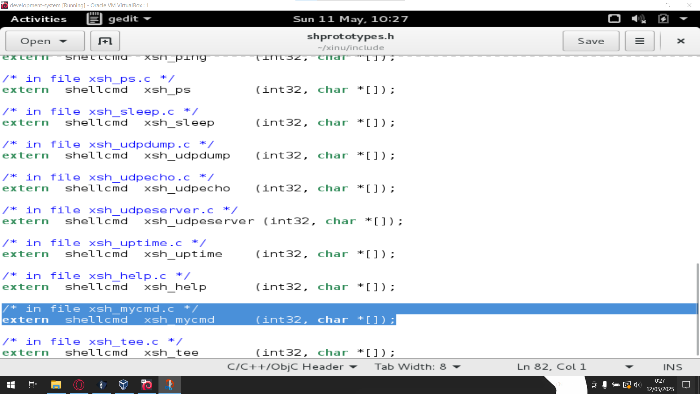
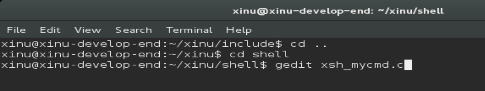
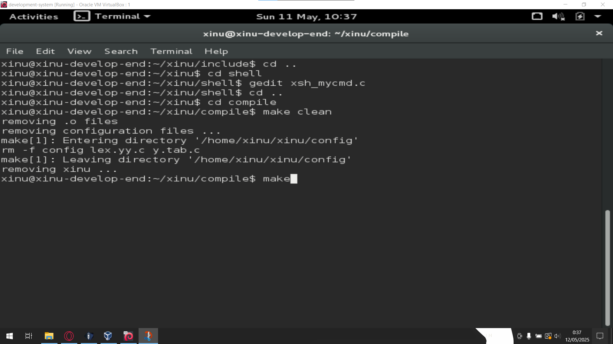
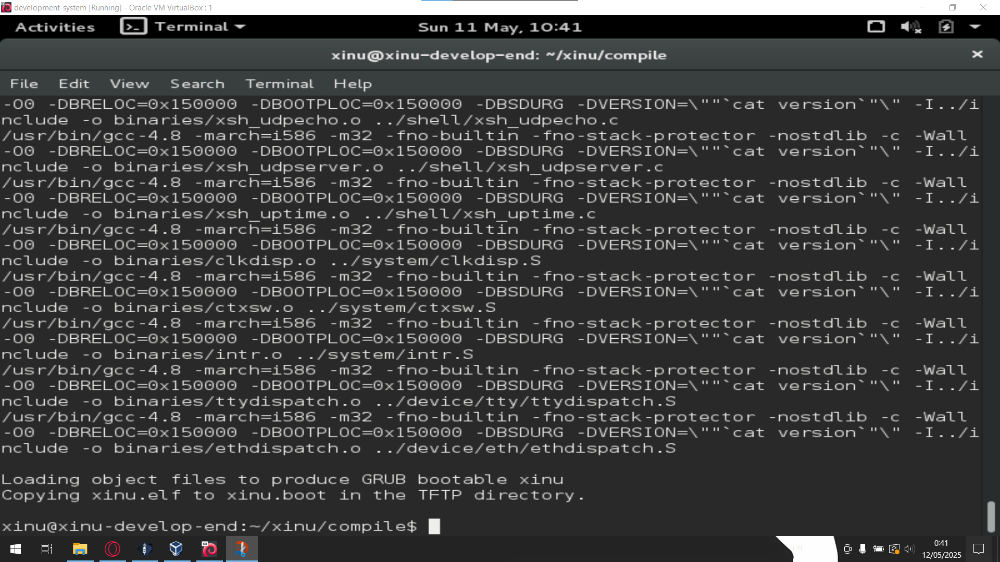
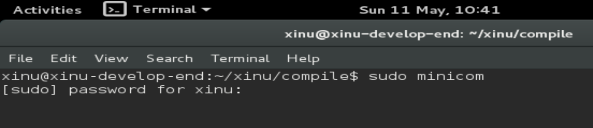
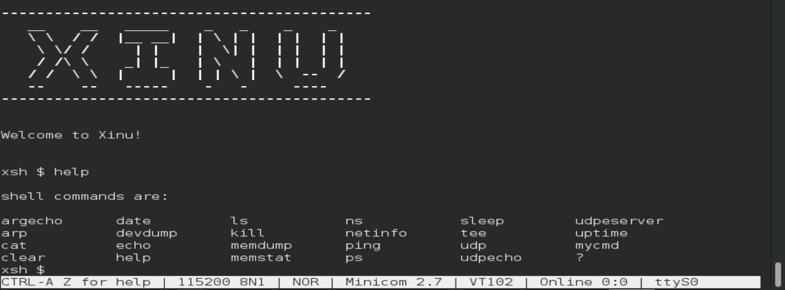
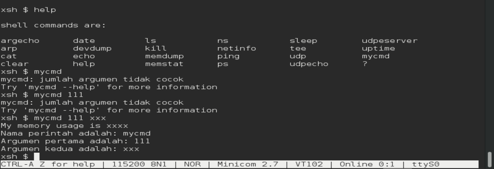

# Tutorial Xinu Shell

Assalamualaikum wr. wb. Kali ini saya akan memberikan tutorial untuk tugas week 10 menambahkan perintah baru ke shell di xinu.

- Pertama, buka development-system nya. Lalu masuk ke directory shell dengan cara:
  ```console
  cd xinu
  cd shell
  ```
  

- Selanjutnya, edit file shell.c dengan cara:
  ```console
  gedit shell.c
  ```
  

- Lalu, tambahkan `{"mycmd",      xsh_mycmd},` dibawah `{"uptime",      xsh_uptime},` seperti gambar dibawah
  

- Setelah itu, keluar dari directory shell lalu masuk ke directory include dengan cara:
  ```console
  cd ..
  cd include
  ```
  

- Kali ini kita akan mengedit file `shprototypes.h` dengan cara:
  ```console
  gedit shprototypes.h
  ```
  

- Setelah itu, scroll kebawah dan cari ```xsh_help.c```. Lalu di bawgian bawahnya tambahkan ```/* in file xsh_uptime.c */
extern  shellcmd   xsh_uptime       (int32, char *[]);``` seperti gambar dibawah:
  

- Save filenya, lalu keluar dari directory include dan kembali ke directory shell dengan menggunakan command:
  ```console
  cd ..
  cd shell
  ```
  Setelah itu buat file baru dengan command `gedit xsh_mycmd.c` seperti gambar dibawah:
  
  
  karena filenya baru dibuat, jadi tidak ada isinya. Masukkan kode ini kedalam file xsh_mycmd.c:
  ```console
  /* xsh_mycmd.c - xsh_mycmd */
  
  #include <xinu.h>
  #include <stdio.h>
  #include <string.h>
  
  // deklarasi nama fungsi
  static void printMemUse(void);
  
  shellcmd xsh_mycmd(int nargs, char *args[]) {
  
      /* For argument '--help', emit help about the 'mycmd' command */
      // mycmd --help
      // jika perintah adalah "mycmd --help" tampilkan help
      if (nargs == 2 && strncmp(args[1], "--help", 7) == 0) {
          printf("Use: %s argument1 argument2\n\n", args[0]);
          printf("Description:\n");
          printf("\tMy own command with 2 argument\n");
          printf("Options:\n");
          printf("\t--help\t display this help and exit\n");
          return 0;
      }
  
      /* Check for valid number of arguments */
      // banyaknya argument harus 2; args[0] = nama_perintah args[1]= argumen 1 args[2] = argumen 2
      if (nargs != 3) {
          fprintf(stderr, "%s: jumlah argumen tidak cocok\n", args[0]);
          fprintf(stderr, "Try '%s --help' for more information\n",
                  args[0]);
          return 1;
      }
  
      printMemUse();
      printf("Nama perintah adalah: %s \n", args[0]);
      printf("Argumen pertama adalah: %s \n", args[1]); // 123
      printf("Argumen kedua adalah: %s \n", args[2]);   // xxx
      return 0;
  }
  
  /*------------------------------------------------------------------------
   * printMemUse - Print statistics about memory use
   *------------------------------------------------------------------------
   */
  void printMemUse(void) {
      printf("My memory usage is xxxx\n");
  }
  ```

- Jangan lupa file nya di save agar tidak mengulang step sebelumnya. Setelah itu, keluar dari directory shell lalu masuk ke directory compile dengan cara:
  ```console
  cd ..
  cd compile
  ```
  Lalu ketik `make clean` setelah itu `make` seperti gambar dibawah:
  

- Jika muncul seperti ini berarti tidak ada yang error:
  

- Setelah itu, buka `sudo minicom` lalu masukkan password xinu nya
  
  
  jangan lupa, setelah memasukkan password, nyalakan backend nya.

- Setelah muncul logo xinu, coba ketik command `help`. Pastikan apakah command `mycmd` sudah terbaca.
  

- Jika sudah muncul, coba lakukan seperti gambar yang ada dibawah:
  
  
  jika berhasil maka akan muncul seperti gambar diatas.
